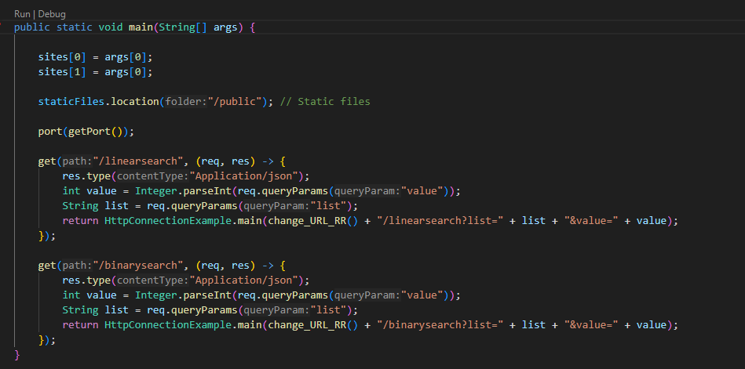
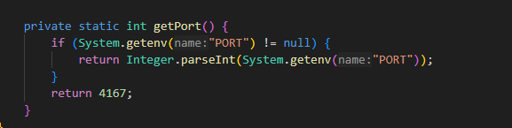

# Parcial AREP 2

## Autor
Steven Alejandro Huertas Lemus

## Proposito

El diseño propuesto consiste en un sistema de microservicios que incluye un servicio de funciones de ordenamiento, representado como "Math Services", desplegado en al menos dos instancias virtuales de EC2. Además, se implementa un servicio proxy que recibe solicitudes de clientes y las distribuye a las instancias de ordenamiento utilizando un algoritmo de round-robin. El proxy, alojado en otra instancia EC2, permite configurar las direcciones y puertos de las instancias de servicio mediante variables de entorno del sistema operativo. Se completa el sistema con un cliente web mínimo, desarrollado en HTML y JS, que presenta formularios para cada función de ordenamiento y realiza llamadas asíncronas al servicio a través del proxy.

## Arquitectura

  


## Ejecucicion y requisitos LOCAL

1. Java 8 y maven
2. descargar el repositorio y situarce en la carpeta raiz del codigo
3. Utilizar el comando

```
mvn clean install

```

4. ejecutar los servicios en el orden: MathService -> Proxy Server con los comandos:

```
 java -cp "target/classes;target/dependency/*" edu.escuelaing.arem.ASE.app.MathServices

```

```
 java -cp "target/classes;target/dependency/*" edu.escuelaing.arem.ASE.app.ProxyServer http://localhost:4567 http://localhost:4567

```

A continuacion la explicación...

## Diseño

Se crean 3 clases, Proxy server donde esta se realizando el RoundRobin y ademas se tiene el recurso html, MathService que realiza todas las operaciones de acuerdo a un endpoint y finalmente httpconnetion que crea la comunicacion entre cada las dos clases anterires

### MathService

Esta clase contiene el método main, que es el punto de entrada de la aplicación. Dentro del método main, se configura el puerto del servicio web utilizando el método getPort() y se definen dos endpoints GET: /linearsearch y /binarysearch.

Este endpoint realiza una búsqueda lineal en una lista de enteros. Obtiene los parámetros de consulta value y list del request, convierte la lista de enteros a un arreglo de Strings, realiza la búsqueda lineal y devuelve un JSON con la operación, la lista de entrada, el valor buscado y el resultado de la búsqueda.
  

Este endpoint realiza una búsqueda binaria en una lista ordenada de enteros. Al igual que el endpoint anterior, obtiene los parámetros de consulta value y list, convierte la lista de enteros a un arreglo de Strings, realiza la búsqueda binaria llamando al método binarySearch y devuelve un JSON con la operación, la lista de entrada, el valor buscado y el resultado de la búsqueda.
 
  

Este método Binary implementa la búsqueda binaria de manera recursiva en un arreglo de Strings que contiene números enteros. Recibe el arreglo, los índices izquierdo (l) y derecho (r) del subarreglo en el que se realiza la búsqueda, y el valor a buscar (x). Retorna el índice del valor si se encuentra en el arreglo, de lo contrario, retorna -1.

  

Este método Get Port obtiene el puerto del sistema en el que se ejecuta la aplicación. Si la variable de entorno PORT está definida, utiliza ese valor como puerto; de lo contrario, utiliza el puerto 4567 por defecto.

 


### ProxyServer

Es la clase principal que contiene el método main, el cual es el punto de entrada de la aplicación.

Nos apoyaremos de dos variables
sites: Un arreglo de Strings que almacena las URLs de los sitios a los cuales se realizarán las peticiones.
counter: Un contador que se utiliza para alternar entre las URLs de los sitios.


Para cumplir con el Roun robin creamos los endpoints /linearsearch y /binarysearch.

Ambos endpoints reciben parámetros de consulta value y list del request y los utilizan para construir y enviar solicitudes HTTP a las URLs de los sitios alternados.
Los resultados de las solicitudes HTTP son retornados como respuestas JSON.

  

El método change_URL_RR alterna entre las URLs de los sitios almacenadas en el arreglo sites utilizando el contador counter.
  

Para este caso de ejecucion local cambiaremos el puerto para que no entre en conflicto, asi mismo las urls mathservices que usaremos sera una no mas con el fin de hacerlo loca, en aws cambiaremos a puerto 4567 y con urls diferentes

  


### HttpConnection

Es la conexion tradicional, sin embargo fue modificada par retornar la conexion y ademas de ello para recibir de a un argumento

 


### Formato Lineal Search


Este es un código HTML que contiene dos formularios para realizar operaciones de búsqueda lineal y búsqueda binaria a través de endpoints RESTful en un servidor web.

Lineal Search:

Es formulario que permite al usuario ingresar una lista de números y un valor a buscar para realizar una búsqueda lineal. El formulario tiene un botón "Submit" que activa la función loadGetMsg1() al hacer clic. Cuando se envía el formulario, se utiliza XMLHttpRequest para enviar una solicitud GET al endpoint /linearsearch del servidor con los parámetros list y value. La respuesta de la solicitud se muestra en un div con el id "getrespmsg1".

 


### Formato Binary Search

Binary Search:

Es formulario que permite al usuario ingresar una lista de números y un valor a buscar para realizar una búsqueda lineal. El formulario tiene un botón "Submit" que activa la función loadGetMsg1() al hacer clic. Cuando se envía el formulario, se utiliza XMLHttpRequest para enviar una solicitud GET al endpoint /linearsearch del servidor con los parámetros list y value. La respuesta de la solicitud se muestra en un div con el id "getrespmsg1".

 


### Ejecucion Math Service LOCAL

Se evidencia la ejecucion con el comando:

```
 java -cp "target/classes;target/dependency/*" edu.escuelaing.arem.ASE.app.MathServices

```

  


### Ejecucion Proxy Server LOCAL

Se evidencia la ejecucion con el comando:

```
 java -cp "target/classes;target/dependency/*" edu.escuelaing.arem.ASE.app.ProxyServer http://localhost:4567 http://localhost:4567

```

Nota: para realizar el Round Robin se deben enviar 2 argumentos, en este caso, como es local enviaremos 2 veces el mismo sitio, en aws enviaremos sitios diferntes.

  


### Evidencia 1


 


### Evidencia 2


  

## AWS

La idea de esto es ahora realizar la distribucion del servicio MathService en 2 instancias, y una mas para ProxyServer, alli se realizara el RR

### Reglas de seguridad 

Se establecen reglas de entrada y salida para permitir todo trafico

  


### Creacion de las instancias

Se crean las instancias en Linux Amazon con el tier FREE, cada una de estas maquinas debe contar con:

1. Java 8
2. Maven
3. Git
4. Repositorio descargado

  


### Clonacion y compilacion

Los servicices se deben iniciar en el orden MathService -> ProxyServer Para iniciar el proceso en las instancias debe:


1. Situarce en la carpeta raiz del codigo
2. utilizar el comando

```
 mvn clean install

```

3. Para iniciar en las 2 instancias MathService utilice el comando

```
 java -cp "target/classes;target/dependency/*" edu.escuelaing.arem.ASE.app.MathServices

```

2. Para iniciar la instancia ProxyServer utilice el comando

```
 java -cp "target/classes;target/dependency/*" edu.escuelaing.arem.ASE.app.ProxyServer URL1 URL

```

En mi caso y para mis instancias:

```
java -cp "target/classes:target/dependency/*" edu.escuelaing.arem.ASE.app.ProxyServer http://ec2-54-210-176-162.compute-1.amazonaws.com:4567 http://ec2-54-83-71-90.compute-1.amazonaws.com:4567

```

  


### Evidencia 2

Se evidencia corriendo en la instancia proxy el servicio

  


### Evidencia 2

Se evidencia corriendo en la instancia proxy el servicio

  


## VIDEO

https://youtu.be/lM1LTsGWcqE?si=2EEgCjPy4ZtBfJJI   
